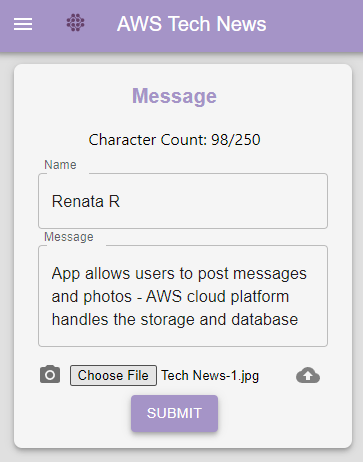

# aws-news
[](https://opensource.org/licenses/MIT)

## Description

Application allows users to post messages and photos, using MongoDB, Express.js, React and Node.js - AWS cloud platform handles the storage and database

## Preview
 

## Table of Contents

- [Installation](#installation)
- [Usage](#usage)
- [Features](#features)
- [License](#license)
- [Contributing](#contributing)
- [Tests](#tests)
- [Questions](#questions)
- [Credits](#credits)

## Installation

Install Node.js and npm

## Usage

User can post messages and upload an image, using AWS S3 bucket.


## Features
 - Mobile friendly application
 - Post news and messages
 - Upload photos and images
 - Posts will be saved in the home page and available in user's page as well.
 - User's profile page shows all user's posts:


## Built With

 - React - JavaScript library for building user interfaces
 - Node.js - JavaScript runtime for server-side programming
 - AWS Ubuntu - Operating system for cloud computing
 - Nginx - Web server for serving static files

## License

[](https://opensource.org/licenses/MIT)

This application is covered by MIT license, available at:
https://opensource.org/licenses/MIT

## Contributing

Please feel free to send a pull request, the following is my GitHub account: https://github.com/Renatatims

## Tests

```
npm start
```

## Questions

If you have any questions please contact me at:

- GitHub account:https://github.com/Renatatims
- e-mail account: renatatims@gmail.com

## Credits

Coding-Bootcamp continuation Courses - AWS
